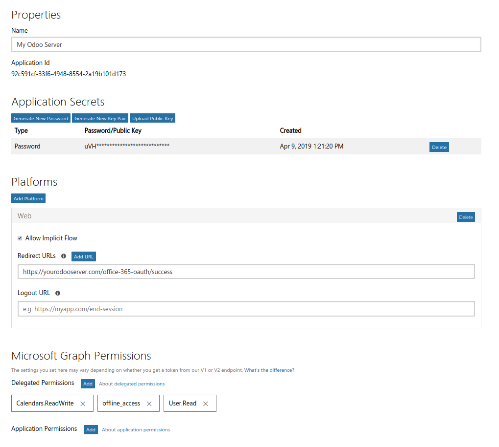

First you have to register your Odoo server with the Microsoft App Registration Portal:

#. Go to https://apps.dev.microsoft.com/;
#. under Converged applications click 'Add an app';
#. fill in any name e.g. 'My Odoo Server';
#. click 'Generate New Password' and store the password we will need it later;
#. click 'Add Platform' and select 'Web';
#. enter the redirect url e.g.: 'https://yourodooserver.com/office-365-oauth/success' replace 'yourodooserver.com' with the address of your Odoo server (note that your Odoo server has to be accessible via HTTPS);
#. add the following permissions: 'User.Read', 'Calendars.ReadWrite', and 'offline_access'.

It should look like this:

Setup Odoo:

#. Go to Settings > General Settings;
#. fill the Client ID with the Client ID / Application ID from the Microsoft App Registration Portal;
#. put the password from before in Client Secret.

